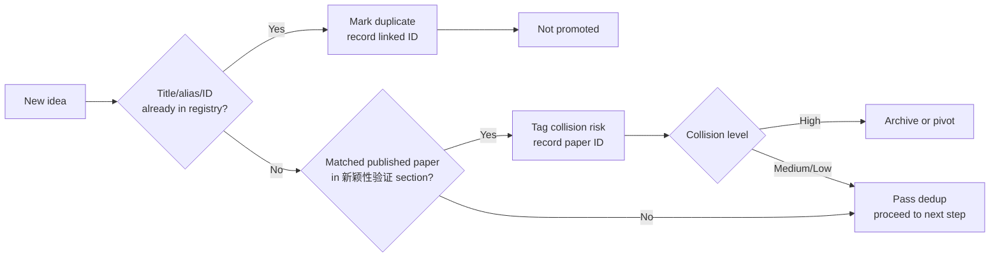

# Research Ideation v4

[](LICENSE)
[](https://www.python.org/downloads/)
[]()

🇨🇳 [中文](README.zh.md)

An evidence-backed workflow for generating, screening, evaluating, and managing academic research ideas.

---

### What's new in v4.2

- **Slimmed SKILL.md.** Down from 198 lines to ~120. A task router table tells you which file to read for each task — brainstorming only reads the entry point.
- **9 references → 5.** `validation-routes.md`, `research-profiles.md`, `evaluation-template.md`, `scoring-v2.md`, and `story-framing.md` merged into `evaluation-guide.md`. Same content, fewer files.
- **3-point output format.** Each generated idea is presented as: (1) what problem it solves, (2) the unique innovation hook, (3) the practical or theoretical value. No paragraphs.
- **Built-in communication style.** The skill tells the AI to use plain language, no double quotes for hedging, assume the user is a beginner, put conclusions first, and write in Chinese only (for Chinese users).
- **Smarter dedup.** Deduplication now checks both the idea registry and the `新颖性验证` section (published-paper mappings in the same file), preventing collisions with prior art.
- **Default to effect-efficacy route.** Most published SCI papers follow the "borrow a mature method, adapt, compare against baselines" pattern. Only switch to problem-existence when the central claim depends on proving a limitation exists.

### Install

Use the repository as a skill folder, or build a lean runtime archive:

```bash
python scripts/package_skill.py dist/research-ideation.zip
```

The archive includes only runtime skill files. Repository documentation, tests, Git metadata, and release artifacts are excluded.

### Initialize an IDEA workspace

```bash
python scripts/init_idea.py /path/to/IDEA
```

The initializer creates:

```text
IDEA/
├── 01-灵感收集/
│   ├── 索引.md
│   ├── 想点子指南.md
│   ├── 待评估点子.md
│   ├── _研究点子卡模板.md
│   ├── evidence-log.md
│   └── 问题结构图谱.md
├── 02-评估中/
├── 03-进行中/
├── 04-已归档/
├── 05-文献库/
│   └── _文献模板.md
├── 06-跨领域方法库/
│   ├── 索引.md
│   ├── 扫描记录.md
│   └── 领域/
│       └── _方法卡模板.md
└── README.md
```

Existing files are preserved. Use `--force` only when replacement is intentional.

### Validate

```bash
python scripts/validate_idea_index.py /path/to/IDEA
python scripts/validate_idea_index.py /path/to/IDEA --json
python scripts/validate_idea_index.py /path/to/IDEA --strict --require-ids
python scripts/validate_idea_index.py /path/to/IDEA --verbose
```

The validator checks:

- Stable and duplicate idea IDs
- Canonical and legacy statuses
- Required decision fields and score ranges
- Folder-to-registry consistency
- White-paper `idea_id` frontmatter
- Evidence/claim IDs and unresolved references
- Inbox dispositions that reference unknown ideas

Legacy title-based registries remain readable. Missing stable IDs and old lifecycle labels become warnings unless `--require-ids` or `--strict` raises the migration bar.

### Eleven generation methods

1. Combination innovation
2. Weakness triangulation
3. Method transplantation
4. Theory deep dive
5. Boundary and assumption challenge
6. Citation-chain gap mining
7. Goal-driven reverse engineering
8. Contradiction mapping
9. Counterexample-first research
10. Measurement-first research
11. Regime and phase mapping

Combination innovation supports two primary validation routes:

- **Problem-existence**: show that a target limitation materially affects the system before investing in a remedy.
- **Effect-efficacy**: adapt a mature method to an established target task and test whether it beats a strong native baseline and direct transfer by a meaningful margin at acceptable cost.

The effect-efficacy route requires baselines, ablations, uncertainty analysis, and resource accounting. It does not require inventing or proving a new target-field defect first.

### Deduplication flow

When a new idea is generated, the system checks both the idea registry and the published-paper mappings (the `新颖性验证` section in 索引.md):



### Run tests

```bash
python -m unittest discover -s tests -v
```

### Core principles

1. A local coverage gap only proves local coverage is incomplete.
2. An idea receives its stable ID when it leaves the inbox; IDs are never reused.
3. Score only after all hard gates are passed.
4. Every score must be accompanied by evidence rationale and confidence level.
5. Compare only ideas scored under the same version and compatible research profiles.
6. Validate immediately after any lifecycle, evidence, or folder change.
7. **Default to the effect-efficacy route.** Most published SCI papers follow the "borrow a mature method, adapt it to the target, compare against baselines" pattern. Only switch to the problem-existence route when the central claim depends on proving that a target limitation actually exists.
8. **Explain as if talking to a beginner.** The skill enforces plain language, no double quotes for hedging, direct conclusions first, and no unnecessary English mixing in Chinese contexts.

### Repository layout

```text
SKILL.md                    Core workflow and routing (task router table)
agents/openai.yaml          Codex UI metadata
assets/                     Workspace templates
references/                 References (5 files, down from 9)
references/evaluation-guide.md  Route selection, profiles, template, scoring, framing
references/idea-generation-methods.md  11 generation methods with selection table
references/novelty-protocol.md    Novelty-claim decomposition and literature verification
references/cross-domain-method-atlas.md  Combination-search protocol
references/data-contract.md       Registry, evidence, and claim data contracts
scripts/init_idea.py        Deterministic initializer
scripts/validate_idea_index.py  Workspace validator
scripts/package_skill.py    Lean release builder
tests/                      Standard-library test suite
```

MIT License.
