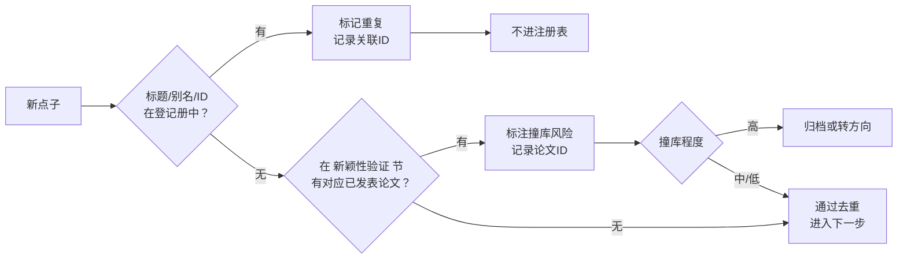

# Research Ideation v4

[](LICENSE)
[](https://www.python.org/downloads/)
[]()

🇬🇧 [English](README.md)

一套基于证据的学术研究点子生成、筛选、评估和管理的系统化工作流。

---

### v4.3 的新内容

- **SKILL.md 精简了。** 从 198 行压到 120 行左右，顶部加了任务路由表，告诉你不同任务该读哪个文件。普通发散只看入口文件。
- **9 个参考文件 → 5 个。** `validation-routes.md`、`research-profiles.md`、`evaluation-template.md`、`scoring-v2.md`、`story-framing.md` 合并成 `evaluation-guide.md`。内容没少，文件少了。
- **三点输出格式。** 每个生成的点子按"解决什么问题/创新切入点/应用价值"三点出，每点 1-2 句话。
- **内置通信风格。** 告诉 AI 用大白话、别用引号做强调、把用户当新手解释、结论先行、中文回答不混英文。
- **查重更完整。** 去重时不仅查点子登记表，还查同一个文件里的"新颖性验证"章节（已发表论文映射），防止撞库。
- **默认效果实证路线。** 大多数 SCI 论文都是借成熟方法→做适配→跟基线比效果这套路。只有核心贡献是证明某个问题真的存在时，才切到问题存在路线。

### 去重流程

新点子生成后，同时检查登记册和已发表论文映射（索引.md 里的"新颖性验证"章节）：



### 初始化

```bash
python scripts/init_idea.py /path/to/IDEA
```

默认不会覆盖已有文件。需要明确替换模板时才使用 `--force`。

初始化器创建的目录结构：

```text
IDEA/
├── 01-灵感收集/
│   ├── 索引.md
│   ├── 想点子指南.md
│   ├── 待评估点子.md
│   ├── _研究点子卡模板.md
│   ├── evidence-log.md
│   └── 问题结构图谱.md
├── 02-评估中/
├── 03-进行中/
├── 04-已归档/
├── 05-文献库/
│   └── _文献模板.md
├── 06-跨领域方法库/
│   ├── 索引.md
│   ├── 扫描记录.md
│   └── 领域/
│       └── _方法卡模板.md
└── README.md
```

### 校验

```bash
python scripts/validate_idea_index.py /path/to/IDEA
python scripts/validate_idea_index.py /path/to/IDEA --strict --require-ids
```

校验器检查：

- ID 唯一性及稳定性
- 状态是否符合规范
- 必填决策字段与分值范围
- 文件夹与注册表一致性
- 白皮书 `idea_id` 元数据
- Evidence/claim ID 及未解析引用
- Inbox 中引用了不存在点子的记录

旧索引仍可读取；旧状态、缺失稳定 ID、标题模糊匹配会给出迁移警告。新建工作区应直接满足 v4 契约。

### 十一种生成方法

1. 组合创新
2. 弱点三角验证
3. 方法移植
4. 理论深挖
5. 边界与假设挑战
6. 引文链缺口挖掘
7. 目标反向推导
8. 矛盾地图
9. 反例先行
10. 测量先行
11. 制度与相图

组合创新不直接做"领域名 × BRB"，而是先选择主要验证路线：

- **问题存在性**：先验证目标问题是否真实且足够严重，再评价解决方案。
- **效果实证**：目标任务本身已经成立，直接检验适配后的成熟方法能否以有意义幅度优于强基线和未经适配的直接移植。

两条路线都检查结构拟合、假设兼容性、本领域替代方案和非平凡改造，并保留负匹配历史。效果实证型必须报告消融、不确定性以及数据、参数、调参、计算和维护成本，不能只报告单一数据集上的平均提升。

### 核心原则

1. 本地库缺失只能说明本地覆盖缺口。
2. 点子离开 inbox 时分配稳定 ID，ID 永不复用。
3. 硬门槛通过后再评分。
4. 分数必须包含证据理由和置信度。
5. 只比较相同评分版本和兼容研究类型。
6. 生命周期、证据或文件夹变化后立即校验。
7. **默认走效果实证路线。** 大多数 SCI 论文都是借成熟方法、做适配、跟基线比效果这个路子。只有当你研究的核心贡献是证明某个问题真实存在时，才切换到问题存在路线。
8. **把用户当新手解释。** 用大白话、不用引号做强调、结论先行、中文回答里不混英文。

### 仓库结构

```text
SKILL.md                    核心工作流与路由（含任务路由表）
agents/openai.yaml          Codex UI 元数据
assets/                     工作区模板
references/                 参考文件（从 9 个精简到 5 个）
references/evaluation-guide.md  路线选择、研究类型、模板、评分、叙事框架
references/idea-generation-methods.md  11 种生成方法及选择表
references/novelty-protocol.md   新颖性声明分解与文献验证
references/cross-domain-method-atlas.md  组合搜索协议
references/data-contract.md      注册表、证据、声明数据契约
scripts/init_idea.py        确定性初始化器
scripts/validate_idea_index.py  工作区校验器
scripts/package_skill.py    精简发布包构建器
tests/                      标准库测试套件
```

MIT 许可证。
